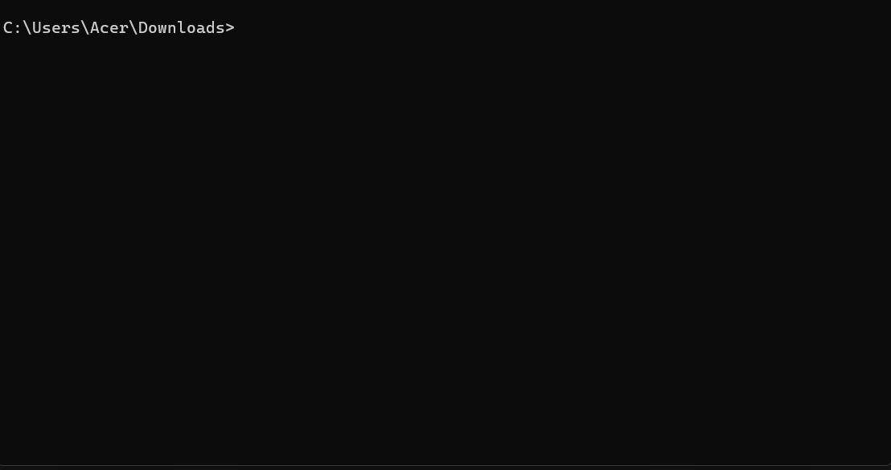

# 🎬 Video to MP4 Parallel Converter: CLI Automation


> **Effortlessly convert batch videos with real-time progress monitoring.**
> 
A high-performance, parallel CLI tool for batch converting videos to Premiere Pro-compatible MP4 format. Built with Python, Typer, and Dockerized for seamless deployment.



## 📄 Executive Summary
* ✅ **Concurrent Transcoding Engine:** Engineered a high-performance batch converter using Python's `ThreadPoolExecutor` to handle parallel video processing and maximize CPU utilization.
* ✅ **Full Containerization:** Implemented a `Docker-based workflow` to encapsulate `FFmpeg` and Python dependencies, ensuring 100% environment consistency and "zero-setup" deployment.
* ✅ **CLI Observability:** Developed a robust Command Line Interface with `Typer` and `Rich`, featuring real-time progress tracking, standardized logging, and intuitive user feedback.
* ✅ **Real-World Solution:** Successfully bypassed cloud converter daily limits and resolved **Adobe Premiere Pro** codec compatibility issues, accelerating the content production pipeline by 5x.

## 📊 Workflow Diagram

## 🧩 Problem & Context

In professional video production, inconsistent codecs are a major bottleneck. Software like Adobe Premiere Pro often suffers from performance lags or crashes when handling unsupported or non-standard video formats.

While working on my own online programming course, I encountered this exact issue. Initially, I relied on cloud-based converters, but I quickly hit daily usage limits, which severely throttled my workflow and delayed the project.

### Solution
* **Engineered a Local CLI Automation Tool:** Developed a high-performance converter using `ffmpeg` and `Python's ThreadPoolExecutor`. This allows for concurrent batch processing to H.264 MP4 (Premiere-ready) format, significantly reducing transcoding time.
* **Containerized the Workflow:** Implemented `Docker` to ensure environment consistency across different machines, making the tool easily shareable and scalable within a team.

### Outcome:
I can now convert entire batches of high-quality video locally—bypassing cloud limits, ensuring format consistency, and significantly speeding up my production pipeline.

## 🧰 Tech Stack
### Core Technologies
* 🐍 **Language:** Python 3.11+
* 🎥 **Engine:** FFmpeg (The industry-standard multimedia framework for transcoding)
* 🐋 **Containerization:** Docker (for consistent environment and easy development)

### Python Libraries
* **Typer/Rich:** For building beautiful and intuitive Command Line Interface (CLI) with progress bars.
* **Concurrent.futures:** To handle multi-threaded parallel processing.
* **Pathlib:** For modern and robust file system path manipulations.

### Development Tools
* **Pyproject.toml:** For modern Python packaging and dependency management.
* **Git:** For version control and branching workflow.

## 📂 Project Structure

```
.
├── app/                # app folder
│   ├── __init__.py     # empty file marked 'app' as a Python package
│   └── converter.py    # main logic for conversion
├── .dockerignore       # optimize build context by excluding unnecessary files
├── assets/             # assets folder (eg. images)
│   └── demo_cli.gif    # project demo preview
├── .gitignore          # excludes unnecessary files from version control
├── Dockerfile          # blueprint for creating image
├── pyproject.toml      # cli entry-point configuration
└── README.md           # YOU ARE HERE!
```

## 🖥️ User Guide

### 📦 Prerequisites
* **Docker Desktop** installed and running.
* **Git** installed (for cloning project).
* (Optional) **Python 3.11+** if running without containerization.

### 🚀 Quick Start with Docker (Recommended)
This is the fastest way to get started without worrying about FFmpeg or Python dependencies.

**1. Clone the Project:**
```bash
# 1. Clone the repository
git clone https://github.com/SiwatSoongsakul/videos_to_mp4_converter_cli

# 2. Enter the project directory (CRITICAL STEP)
cd videos_to_mp4_converter_cli
```

**2. Build the Image:**
```bash
docker build -t v2mp4 .
```

**3. Run the Conversion**

Mount your local video folder to the container's `/media` directory:
```bash
docker run -it --rm -v "YOUR_LOCAL_VIDEO_PATH:/media" v2mp4 /media -o "destination_folder_name"
```
**Note:** 
* Replace `YOUR_LOCAL_VIDEO_PATH` with the absolute path to your video folder.
* (Optional) Replace `destination_folder_name` with your destination folder name.
  
### 🐍 Running Locally (Development Mode)
If you prefer to run the script directly on your machine:

**1. Clone the Project:**
```bash
# 1. Clone the repository
git clone https://github.com/SiwatSoongsakul/videos_to_mp4_converter_cli

# 2. Enter the project directory (CRITICAL STEP)
cd videos_to_mp4_converter_cli
```

**2. Install dependencies:**
```bash
pip install .
```

**3. Execute:**
```bash
v2mp4 YOUR_LOCAL_VIDEO_PATH -o "destination_folder_name"
```
**Note:** 
* Replace `YOUR_LOCAL_VIDEO_PATH` with the absolute path to your video folder.
* (Optional) Replace `destination_folder_name` with your destination folder name. 

## 🔥 Skills & Takeaways

## 🚀 Future Improvements
* ☁️ **Cloud Storage Integration:** Add support for `S3/GCS` buckets to transcode directly from the cloud.

* ⚡ **GPU Acceleration:** Implement `NVENC/Hardware acceleration support` for even faster transcoding on compatible machines.

* 🧪 **Automated Testing:** Integrate `Pytest` and `GitHub Actions` for continuous integration and automated Docker builds.
  
* 📂 **Smart Sorting:** Add `AI-based video categorization` before transcoding based on file metadata.